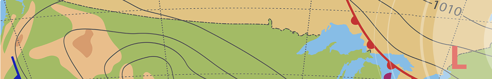

# World Weather Analysis

## Overview
At the most fundamental level, Jack needs help answering a question: How might we provide real-time suggestions for our client's ideal hotels? Your first task was to define what you meant by "ideal." So, over the course of the conversation, you narrowed that to 
hotels that were 
1.  within a given range of latitude and longitude and that
2.  provided the right kind of weather for the client.

* _**Task:**_ Collect and analyze weather data across cities worldwide.
* _**Plan:**_ PlanMyTrip will use the data to recommend ideal hotels based on clients' weather preferences.
* _**Method:**_ Create a Pandas DataFrame with 500 or more of the world's unique cities and their weather data in real time. This process will entail collecting, analyzing, and visualizing the data.

Your analysis of the data will be split into three main parts, or stages.

### Resources
* Data Source: city_data.csv, ride_data.csv
* Software: Python 3.7.10, Jupyter Notebook 6.3.0, CitiPy 0.0.5, APIs, JSON Traversals
* 
## Collect the Data
* Use the NumPy module to generate more than 1,500 random latitudes and longitudes.
* Use the citipy module to list the nearest city to the latitudes and longitudes.
* Use the OpenWeatherMap API to request the current weather data from each unique city in your list.
* Parse the JSON data from the API request.
* Collect the following data from the JSON file and add it to a DataFrame:
1.  City, country, and date
2.  Latitude and longitude
3.  Maximum temperature
4.  Humidity
5.  Cloudiness
6.  Wind speed

## Exploratory Analysis with Visualization
* Create scatter plots of the weather data for the following comparisons:
1.  Latitude versus temperature
2.  Latitude versus humidity
3.  Latitude versus cloudiness
4.  Latitude versus wind speed
* Determine the correlations for the following weather data:
1.  Latitude versus temperature
2.  Latitude versus humidity
3.  Latitude versus cloudiness
4.  Latitude versus wind speed
* Create a series of heatmaps using the Google Maps and Places API that showcases the following:
1.  Latitude versus temperature
2.  Latitude versus humidity
3.  Latitude versus cloudiness
4.  Latitude versus wind speed

## Visualize Travel Data

* Create a heatmap with pop-up markers that can display information on specific cities based on a customer's travel preferences. Complete these steps:

1.  Filter the Pandas DataFrame based on user inputs for a minimum and maximum temperature.
2.  Create a heatmap for the new DataFrame.
3.  Find a hotel from the cities' coordinates using Google's Maps and Places API, and Search Nearby feature.
4.  Store the name of the first hotel in the DataFrame.
5.  Add pop-up markers to the heatmap that display information about the city, current maximum temperature, and a hotel in the city.
