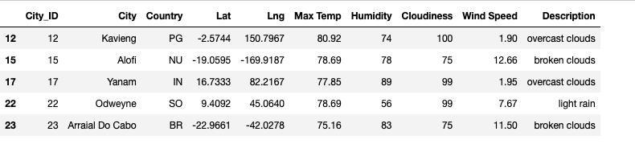
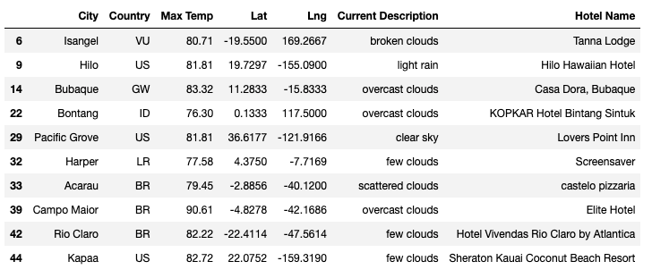
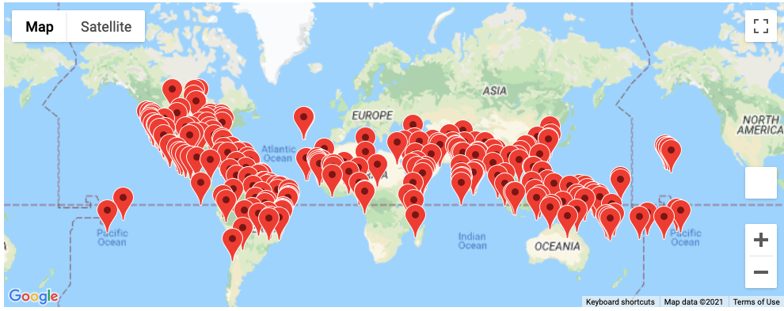
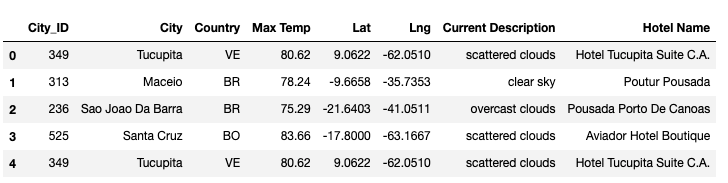
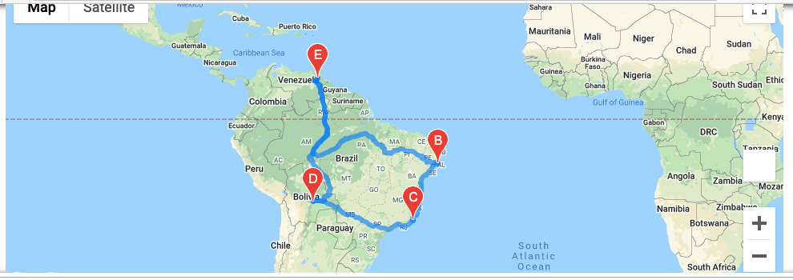
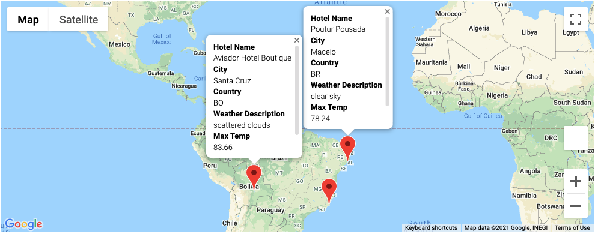

World_Weather_Analysis
# World Weather Analysis

## Overview
This project was to learn about how to utilize Application Programming Interfaces or API's.  Then we were to develop a small application, PlanMyTrip, to see if we could find Cities, Hotels, Weather Details of the Cities, and plan a Trip and detail it on a Map.

## My Process
First I generated 2,000 random Latitudes and Longitudes, then submitted them via the Google Maps API and requested the information in JSON format if the Latitude and Longitude pairing returned a city.  

Reading the response from Google Maps, if we found a city, from these random parings, we retrieved the following information: City, Country, Latitude, Longitude, Maximum Temperature, Humidity, Cloudiness, Wind Speed and Current Description of each city, and stored it into a DataFrame.

---
I then requested a user to enter their desired minimum temperature and maximum temperature of their _perfect vacation_.  I entered those values in our DataFrame as a filter and those cities that met the criteria, were saved into a new Dataframe for a perfect vacation. My next task was go to back to Google Maps and look for the closest Hotel in each of those cities and added the new column, Hotel Name to the DataFrame.

---

### Perfect Vacation Map (_Min Temps 75 - Max Temps 95_)

---
My next goal was to create a Vacation Itinerary.  I choose a city where we would depart from, three stops along the way, and we would return back to our originating city.  I chose these cities from our list of cities found in our Vacation Search.   With that chosen, I then plotted a trip route showing our trip, creating details of our hotels with the markers on the map.

### The Travel Details

### Travel Map

---

### Travel Map with Markers

---
## Summary
This project was fun to create and was very interesting to gather data from public websites that we go to daily in our lives.  This definitely made me interested in persuing more programming with API's and gathering data from more public websites. 

Jill Hughes

